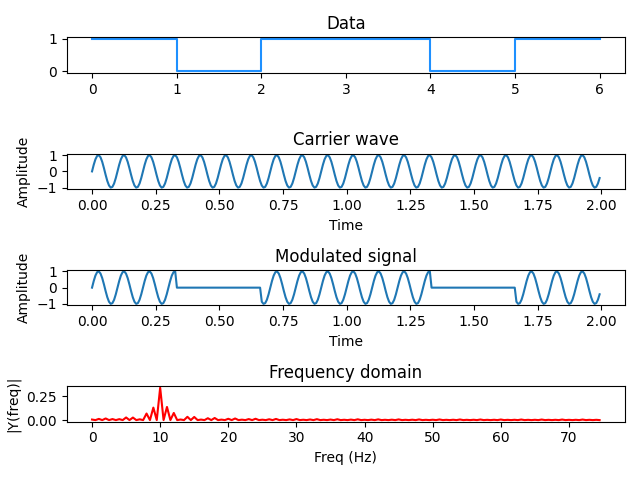
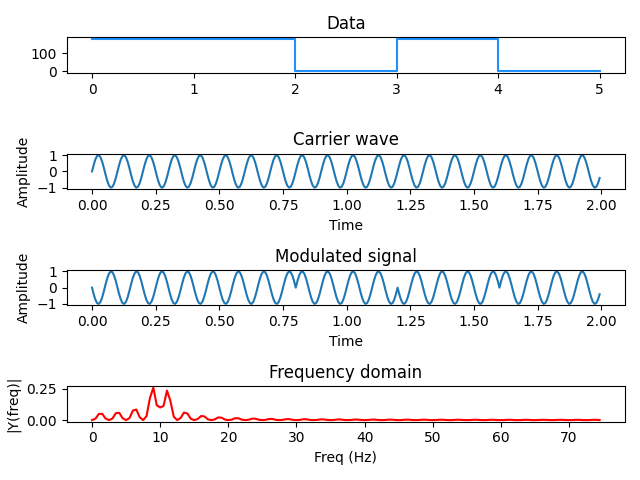

# Digital modulations: ASK, FSK, PSK

A python implementation to visualize digital modulations.

### Installation 🔧


Install the required libraries using the requirements.txt file

```
pip3 install -r requirements.txt
```

You may need to use pip instead of pip3 depending on your system setup.

### Execution 🚀

Pass the desired modulation type as an argument.
Valid options are: ask, fsk, psk
```
python3 digital_modulations.py ask
```
You may need to use python instead of python3 depending on your system setup.

#### Examples

ASK


FSK


PSK

